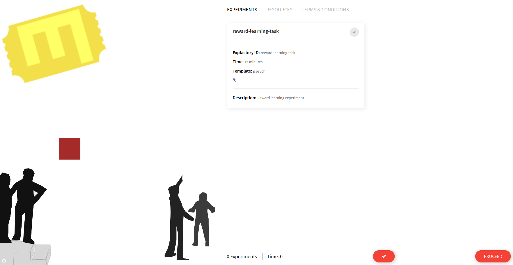

# Experiment Factory Experiment

Hi Friend! This is an Experiment (adopted from [gewimmer-neuro/reward_learning_js](https://github.com/gewimmer-neuro/reward_learning_js/)) that is friendly for use in the [Experiment Factory](https://expfactory.github.io/expfactory). You can run it locally by putting these files in a web server, or use the Experiment Factory to generate a reproducible container. Check out the documentation above for more information, or [post an issue](https://www.github.com/expfactory/expfactory/issues) if you have any questions.


I (@vsoch) did not create the experiment, but it looks like images (and their corresponding id lookup) are stored under [images](images)
and then listed in [js/list.js](js/list.js)

## Build an Experiment Container

These instructions are also available [here](https://expfactory.github.io/generate#quick-start).

First, create a working directory

```bash
mkdir -p /tmp/reward-learning
cd /tmp/reward-learning
```

Then see experiments available

```bash
docker run quay.io/vanessa/expfactory-builder list
```

Generate a container with the reward-learning-task

```bash
docker run -v $PWD:/data quay.io/vanessa/expfactory-builder build reward-learning-task
```

The message will tell you the next step - to build your container! And actually,
you would be best off (if you want to share or reproduce this) to add the Dockerfile
to a GitHub repository and then have an automated build.

```bash
Expfactory Version: 3.16
LOG Recipe written to /data/Dockerfile

To build, cd to directory with Dockerfile and:
              docker build --no-cache -t expfactory/experiments .
```

The `/data` folder in the container is where you just bound the present working directory,
so our Dockerfile and entrypoint script are actually right here!

```bash
$ ls
Dockerfile  startscript.sh
```
We could build that as follows:

```bash
docker build -t reward-learning .
```

And then run it on port 80:

```bash
mkdir -p /tmp/reward-learning/data
docker run -v /tmp/reward-learning/data/:/scif/data -p 80:80 reward-learning start 
```

And then open your browser to [127.0.0.1](127.0.0.1) to see the interface!



By default, the data is saved to the filesystem where you mounted the local data folder.

And of course see the [documentation pages](https://expfactory.github.io/customize) for how to
customize the database, and other configuration. If you need to customize the experiment
repository cloned from (e.g., if you want to make changes) you can edit this in the
Dockerfile:

```
LABEL EXPERIMENT_reward-learning-task /scif/apps/reward-learning-task
WORKDIR /scif/apps
RUN expfactory install https://www.github.com/<username>/reward-learning-task
```
